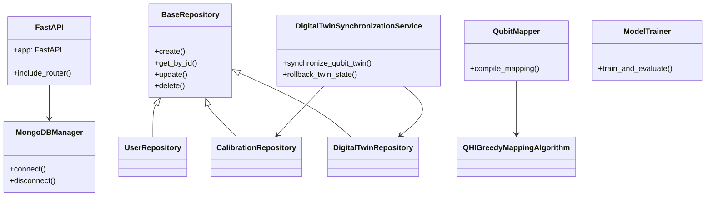
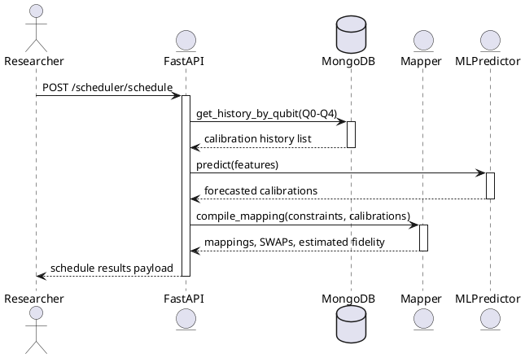
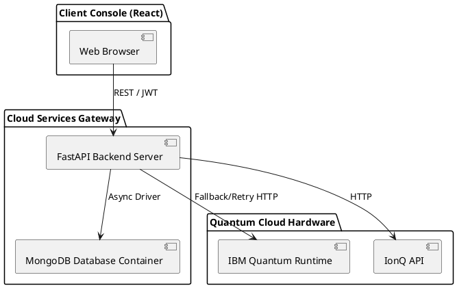

# Architecture Documentation

This document describes the software design layout and structural models of TwinQ-Map.

## 1. System Component Diagram (Mermaid)

## 2. Sequence Workflow: Qubit Scheduling (PlantUML)

## 3. Deployment Topology (PlantUML)

