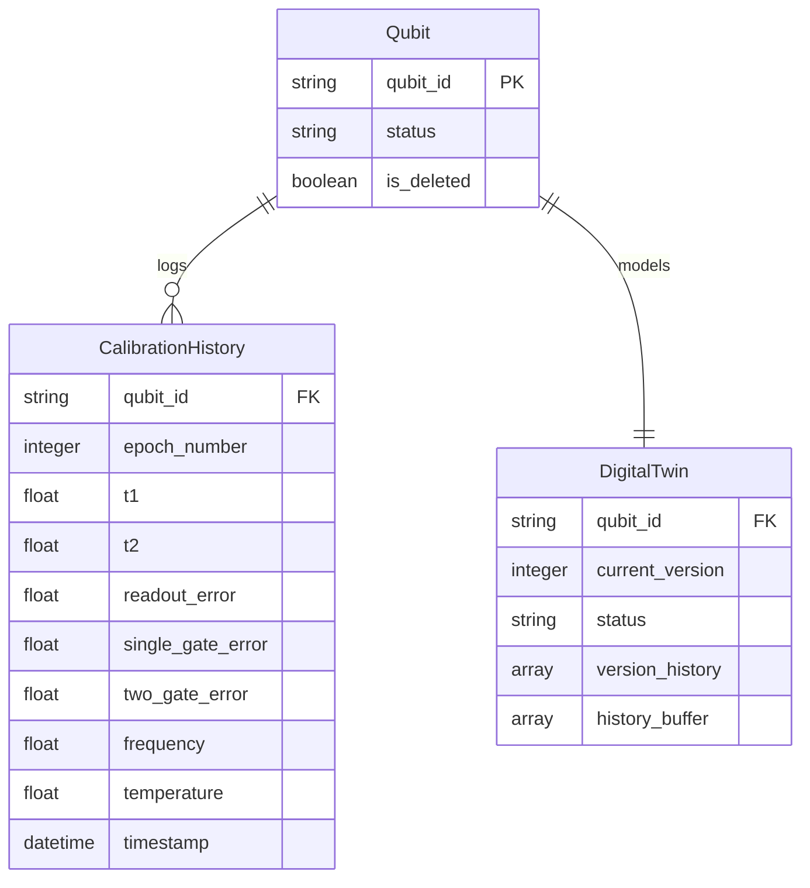

# MongoDB Schema & Database Layout

TwinQ-Map utilizes MongoDB for high-write-throughput calibration histories and JSON-structured digital twin version lineages.

## 1. Entity Relationship (ER) Schema (Mermaid)


## 2. Collection Indexes Configurations
Compound and unique indexes are registered during startup inside `backend/database/collections.py`:
- `qubits`: Unique index on `qubit_id` and filter out soft-deleted documents (`is_deleted: false`).
- `calibration_history`: Compound unique index on `(qubit_id, epoch_number)` ensuring cron uploads or simulator intervals do not duplicate epoch logs.
- `digital_twins`: Unique index on `qubit_id` to enforce a 1-to-1 relationship.

## 3. Drift Analysis Aggregation Pipeline
To calculate rate-of-change statistics, the repository runs MongoDB Aggregation pipelines:
```json
[
  { "$match": { "qubit_id": "Q0" } },
  { "$sort": { "epoch_number": 1 } },
  {
    "$group": {
      "_id": "$qubit_id",
      "avg_t1": { "$avg": "$t1" },
      "min_t2": { "$min": "$t2" },
      "avg_readout": { "$avg": "$readout_error" }
    }
  }
]
```
This is executed asynchronously using Motor.
