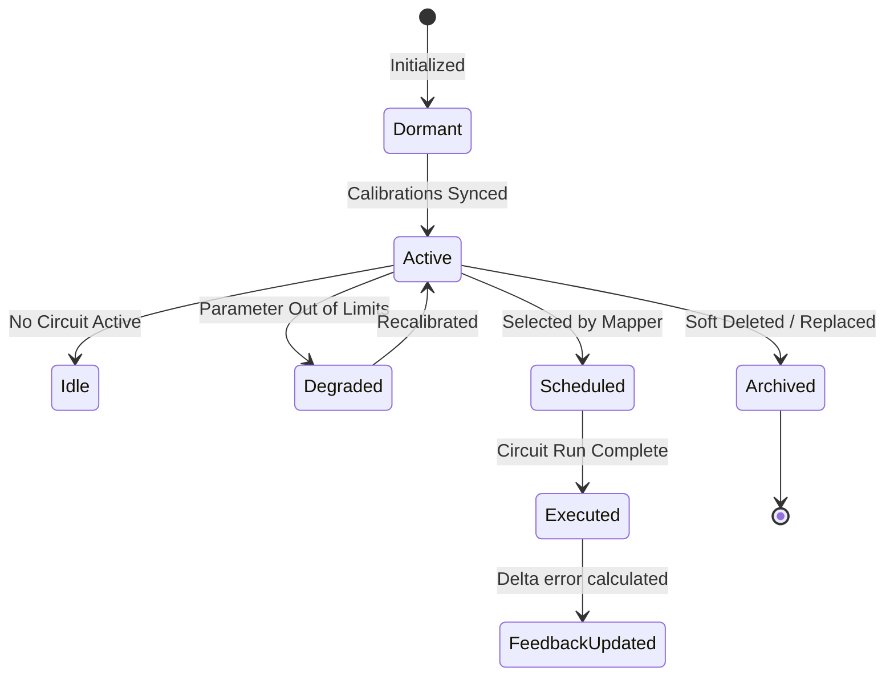
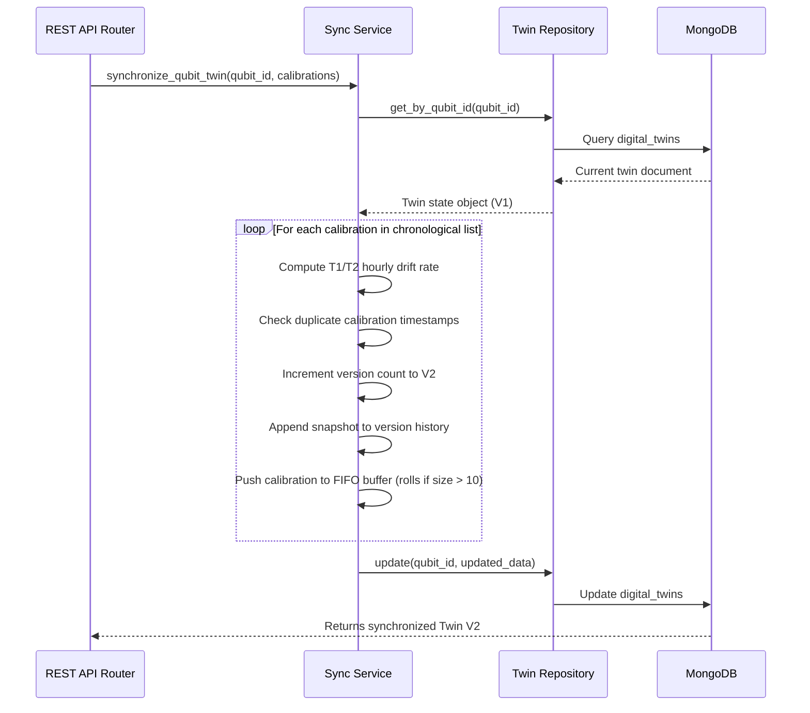

# Digital Twin Synchronization Lineage

This document describes the state machine lifecycle and synchronization engine implementation.

## 1. Physical Qubit Lifecycle State Diagram (Mermaid)

## 2. Synchronization Sequence Workflow (Mermaid)

## 3. Rollback Lineage Truncation
Rollback allows restoring the state machine to a prior version `V_target`.
When a rollback is requested:
1. The service reads the version history list of the Digital Twin.
2. It filters out all snapshots with `version > V_target`.
3. It resets `current_version` to `V_target`.
4. It updates the database record and appends a `"Rollback Performed"` action to the audit trail log list.
5. Invalidation or replacement of subsequent records is logged.
