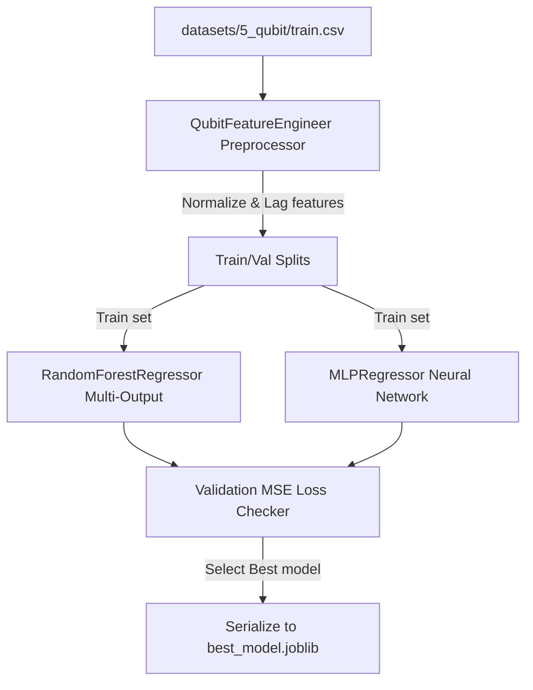

# Machine Learning Forecasting Pipeline

This document describes the multi-target predictive model pipelines.

## 1. Feature Engineering & Preprocessing
To train the predictors to forecast parameters at $t+24$, the pipeline extracts historical lag features:
- **Rolling Averages**: Rolling mean and standard deviation of $T_1$, $T_2$, and readout error over a window of 5 epochs.
- **Historical Lags**: $X_t = [P_{t-1}, P_{t-2}, ..., P_{t-k}]$.
- **Standard Scaling**: Scale all features to normal bounds:
  $$Z = \frac{X - \mu}{\sigma}$$
  where $\mu$ and $\sigma$ are calculated from training partition (`train.csv`).

---

## 2. Model Training Flow (Mermaid)


---

## 3. IEEE-Style Algorithm Pseudocode
```text
============================================================================
Algorithm: TrainPredictorPipeline(train_df, val_df)
============================================================================
Input:  train_df, val_df (Calibration data frames)
Output: Serialized Predictor Parameters
----------------------------------------------------------------------------
1:  Initialize preprocessor QubitFeatureEngineer(window_size=5)
2:  X_train, y_train <- preprocessor.build_features(train_df, is_training=True)
3:  X_val, y_val <- preprocessor.build_features(val_df, is_training=False)
4:  
5:  Initialize models:
6:      RF_Model <- RandomForestRegressor(n_estimators=100)
7:      MLP_Model <- MLPRegressor(hidden_layers=[64, 32])
8:  
9:  Fit models on (X_train, y_train)
10: preds_rf <- RF_Model.predict(X_val)
11: preds_mlp <- MLP_Model.predict(X_val)
12: 
13: mse_rf <- ComputeMeanSquaredError(preds_rf, y_val)
14: mse_mlp <- ComputeMeanSquaredError(preds_mlp, y_val)
15: 
16: If mse_rf < mse_mlp Then
17:     SaveModelParams(RF_Model, "best_model.joblib")
18: Else
19:     SaveModelParams(MLP_Model, "best_model.joblib")
20: End If
============================================================================
```
