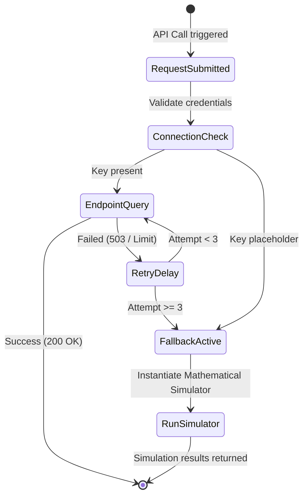

# Quantum Provider Integration

This document describes cloud integrations, retry loops, and adapter configurations.

## 1. Adapter Fallback Architecture
If a cloud provider endpoint (IBM Quantum, IonQ, AWS Braket, Azure Quantum, or Rigetti QCS) is offline, unconfigured, or rate-limited:
1. The adapter catches the connection exception.
2. It attempts up to 3 retries with linear backoff delays.
3. If all attempts fail, it automatically invokes the local `MathematicalQuantumSimulator`.
4. It logs a warning `"Provider unavailable; falling back to Mathematical Simulator"` to centralized logs.

---

## 2. Retry Flow State Diagram (Mermaid)

