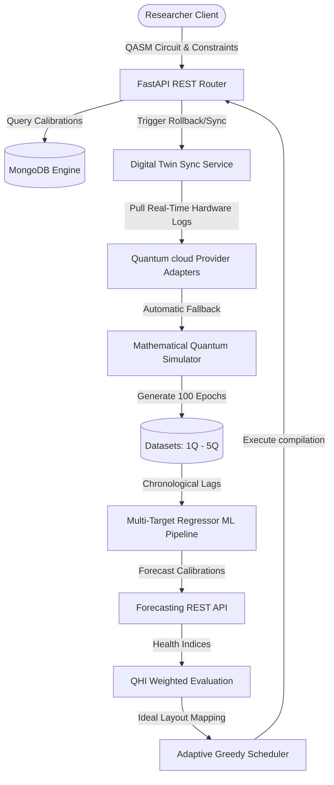

# TwinQ-Map
### Dynamic Digital Twin–Driven Predictive Qubit Mapping for Time-Varying NISQ Processors

TwinQ-Map is a production-ready, research-grade software platform designed to optimize logical-to-physical qubit mapping on noisy intermediate-scale quantum (NISQ) processors. By leveraging a real-time, event-driven Digital Twin synchronization engine and multi-target machine learning regressors, TwinQ-Map predicts physical qubit parameter drifts (coherence times, readout, and gate errors) to optimize quantum circuit execution schedules on time-varying hardware layouts.

---

## 1. System Architecture Layout

### Mermaid Structural Flow Diagram


---

## 2. LaTeX TikZ Schematic
```latex
\begin{tikzpicture}[node distance=2.5cm, auto, >=stealth]
    \node[draw, rounded corners, fill=blue!10] (client) {Researcher Console};
    \node[draw, fill=green!10, below of=client] (api) {FastAPI REST Layer};
    \node[draw, fill=yellow!10, left of=api, node distance=4cm] (db) {MongoDB Storage};
    \node[draw, fill=red!10, right of=api, node distance=4cm] (sync) {Digital Twin Sync};
    \node[draw, fill=orange!10, below of=api] (sim) {Math Simulator Engine};
    \node[draw, fill=purple!10, below of=sim] (ml) {Random Forest Forecast};
    \node[draw, fill=cyan!10, right of=ml, node distance=4.5cm] (sched) {Greedy QHI Scheduler};

    \path[->] (client) edge node {HTTP} (api);
    \path[<->] (api) edge (db);
    \path[->] (api) edge (sync);
    \path[->] (sync) edge (sim);
    \path[->] (sim) edge (ml);
    \path[->] (ml) edge (sched);
    \path[->] (sched) edge (api);
\end{tikzpicture}
```

---

## 3. High-Level Project Directory Structure
```text
TwinQ-Map/
|-- backend/                 # FastAPI server framework, repos, models, and ML pipelines
|-- frontend/                # Vite React dashboard client
|-- datasets/                # Deterministic multi-qubit datasets (1Q to 5Q)
|-- docs/                    # In-depth system design & IEEE LaTeX documentation
|-- docker/                  # Docker containerization files
|-- docker-compose.yml       # Production composer settings
|-- scripts/                 # Dataset generation and helper print utilities
`-- tests/                   # Pytest suite validations
```

For installation and execution instructions, please refer to [INSTALLATION.md](file:///C:/Users/chsai/.gemini/antigravity/scratch/TwinQ-Map/INSTALLATION.md).
