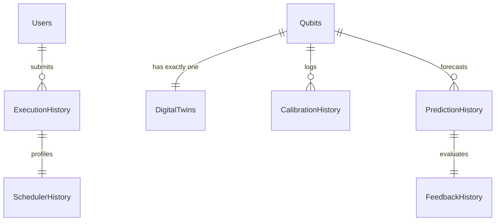

# Database Schema Documentation

This document describes the **TwinQ-Map** MongoDB database schemas, validations, relationships, and index layout.

## Entity Relationship (ER) Diagram

## Collection Index & Validations

### 1. Users Collection
- **Indexes**:
  - `username` (Unique)
  - `email` (Unique)
- **Validation**: Enforces email formats, non-empty usernames, and hashed passwords.

### 2. Qubits Collection
- **Indexes**:
  - `qubit_id` (Unique)
  - `physical_qubit_number`
- **Fields**:
  - `qubit_id` (e.g. "Q0")
  - `physical_qubit_number` (int)
  - `logical_qubit_number` (int, nullable)
  - `backend_name` (str)
  - `backend_type` (str)
  - `status` (Dormant, Initialized, Active, Idle, Degraded, Predicted, Scheduled, Executed, Feedback Updated, Archived)
  - `version` (int)
  - `is_deleted` (bool)

### 3. CalibrationHistory Collection
- **Indexes**:
  - `(qubit_id, epoch_number)` (Unique Compound)
  - `timestamp`
- **Fields**:
  - `qubit_id` (str)
  - `epoch_number` (int)
  - `t1`, `t2` (float)
  - `readout_error`, `single_gate_error`, `two_gate_error` (float)
  - `frequency`, `temperature` (float)
  - `noise_drift`, `drift_rate` (float)
  - `timestamp` (date)

### 4. DigitalTwins Collection
- **Indexes**:
  - `qubit_id` (Unique)
- **Fields**:
  - `qubit_id` (str)
  - `status` (enum)
  - `current_version` (int)
  - `last_updated` (date)
  - `version_history` (Array of snapshots)
  - `history_buffer` (FIFO buffer)
  - `version` (int)
  - `is_deleted` (bool)
