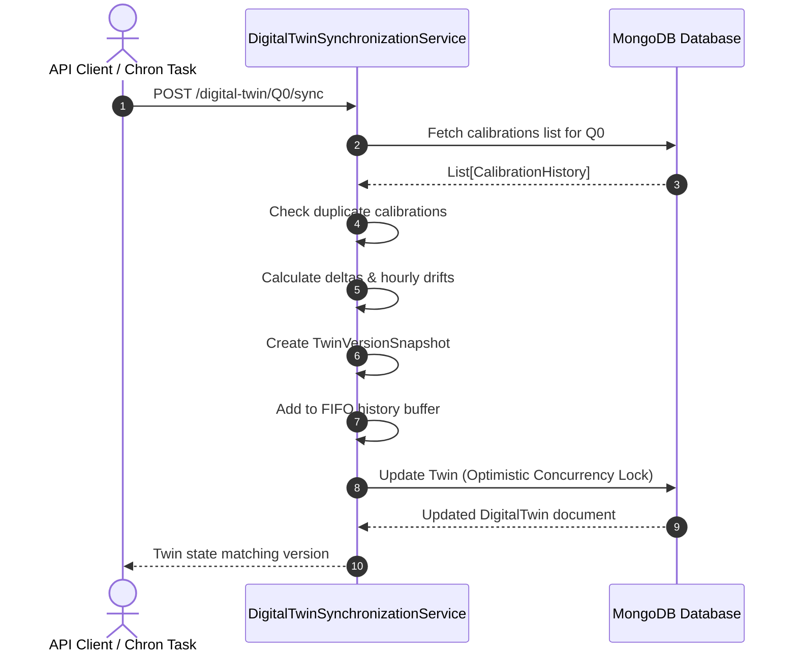
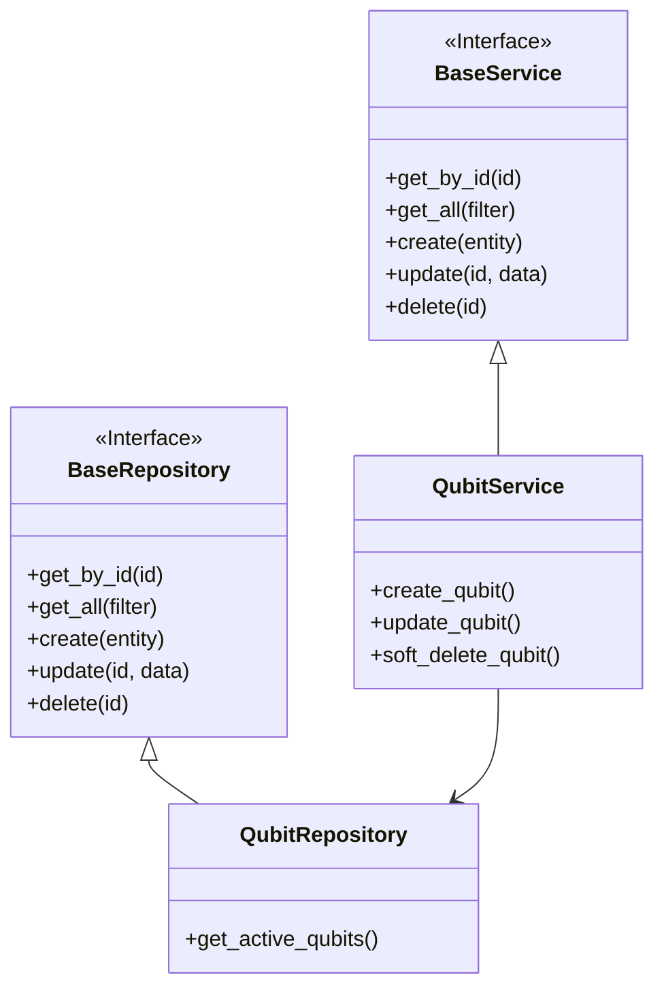

# Synchronization Engine Documentation

This document describes the synchronization workflow and the architectural relationships of repositories and services.

## Synchronization Workflow Diagram

## Repository & Service Architecture

## Duplicate & Conflict Detection
1. **Duplicate Calibration Detection**: Prevent double-syncing calibrations by filtering out incoming calibrations whose `epoch_number` matches existing committed snapshots.
2. **Conflict Detection**: Verify that the document version increment is checked concurrently using MongoDB optimistic locking patterns during document save updates.
